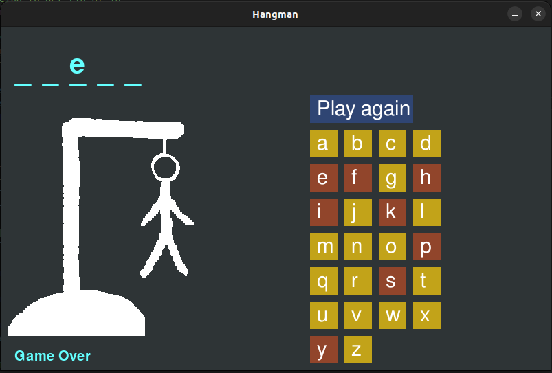

# Hangman
## Funtionality 
The game is based on the classic children's game Hangman. The goal is to guess a hidden word. Individual letters are always suggested and depending on whether the letter appears in the word, it is revealed or a life is deducted. The available lives are symbolized by a drawn gallows and a stick figure hanging on it. As soon as the drawing is complete, the game is lost. Right now from randomly generated words (new_words.txt) a random one is chosen and displayed in the game. The game creates rectangles covering the individual letters. The game creates a pandas dataframe, which has a row for each letter and a corresponding "visible" variable for each row. Once there is a guess, the game updates the visible variable and automaticle the obstacles covering the letters are removed in the next game loop. For each guess it is determied wether a life is lost or not. For each live lost a part of the hangman is drawn. In the end there is the option to replay.

## Purpose of game
I made the game to become familiar with object-oriented programming. So far I have only used python for data analysis, where classes are rather less needed. This is my introduction to object oriented programming. As preparation I used the documentation of [pygame](https://www.pygame.org/news) pygame and a simple [introduction](https://realpython.com/pygame-a-primer/) from the net. It was a lot of fun and I recommend everyone to learn pygame.

